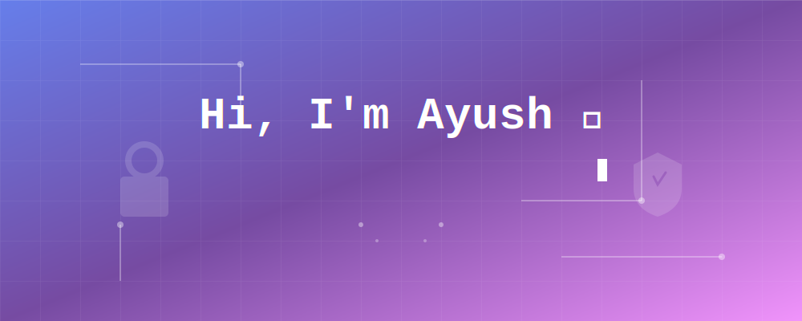

<!--
  KEEP YOUR EXISTING BANNER HERE.
  Replace the src below with the actual path/URL to your current banner image
  (e.g. an image in your repo like assets/banner.png, or wherever it's hosted now).
-->

 

 

👋 Hey, I'm Ayush

Security-focused CS undergrad at SRM Institute of Science and Technology — building at the intersection of cybersecurity and cloud infrastructure.

<table>
<tr>
<td width="50%" valign="top">
🎓 B.Tech CSE — Cybersecurity
📍 Chennai / Kuwait
🎯 Graduating 2028

</td>
<td width="50%" valign="top">
I'm a computer science student specializing in cybersecurity, with a strong foundation in Linux, networking, and Python. My focus is security engineering — building tools and systems that protect infrastructure, not just operate it. I enjoy solving real problems, writing clean code, and understanding how things break.

</td>
</tr>
</table>

 

## 💻 Tech Stack

| Category | Stack |
|:---|:---|
| **Languages** |        |
| **Operating Systems & Linux** |    |
| **Databases** |  |

 

## 📡 Mission Control

 

  

<!--
  ANIMATED CONTRIBUTION SNAKE
-->
<picture>
  <source media="(prefers-color-scheme: dark)" srcset="https://raw.githubusercontent.com/ayushag56648/ayushag56648/output/github-contribution-grid-snake-dark.svg" />
  
</picture>

 

### 🌐 Connect With Me

 

⭐ From <a href="https://github.com/ayushag56648">ayushag56648</a>

